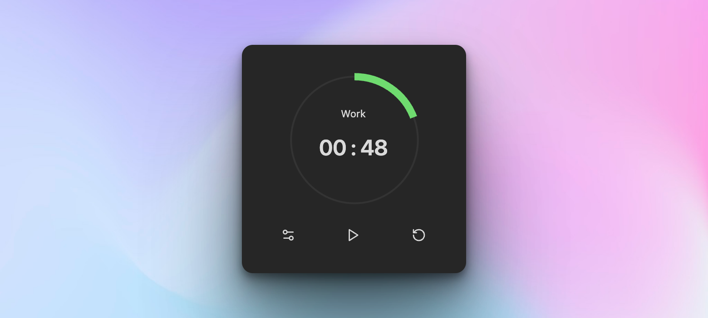
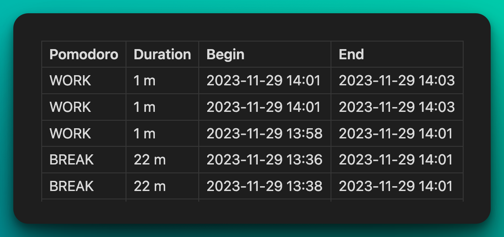
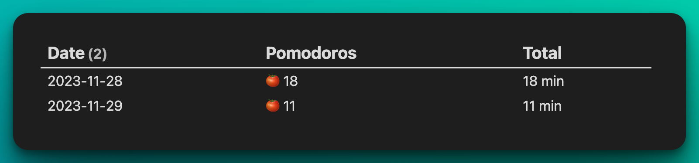

# Obsidian Pomodoro Timer（社区分叉版）


本仓库是从 [@rupel190](https://github.com/rupel190) 的社区维护分叉再次 fork 出来的版本；最初来源是 [@eatgrass](https://github.com/eatgrass) 的原项目。当前维护重点是修复 bug，并补充日常使用中需要的功能。

English: [README.md](README.md)

## 为什么要做这个分叉？

原作者 @eatgrass 的插件已不再活跃维护；在 @rupel190 社区维护版本之后，本仓库再次 fork，用于持续修复问题并实现一些个人工作流中需要的功能。欢迎贡献。

## 本分叉当前新增了什么？

- [ ] feature: 番茄钟支持多任务
  - [x] 支持选择主副任务，番茄钟只记录到主任务下
- [x] UI 
  - [x] 文件名较长或面板较窄时，文件名显示到框外
  - [x] FILE 面板可以渲染任务 markdown，而 TASK 面板展示任务源码，统一为渲染 markdown
- [x] chore: FILE 面板下 All, Todo, Completed 选项卡顺序调整
- [x] chore: 任务结束时的提醒，点击后不在新 pane 中打开，而是在当前 pane 跳转
- [x] fix: 番茄钟结束，在任务后追加番茄标记时，会破坏该任务的缩进结构的问题

###  待开发

- [ ] feature: 番茄钟支持多任务
  - [ ] 番茄钟记录到所有共同进行的任务下，与单番茄任务用不一样的图标记录
  - [ ] 番茄钟结束时，弹窗（或 UI 覆盖）请用户确认记录任务
- [ ] feature: 番茄钟记录到进行的待办任务下
- [ ] feature: 番茄钟记录到指定标题（@rupel190 提及但未实装）


## [@rupel190](https://github.com/rupel190) 分叉新增了什么？

- **会话备注日志**：每次番茄都可以写一句备注，并随日志保存，方便复盘。
- **快速开始选中任务命令**：可绑定快捷键，一步完成“选任务 + 固定 + 开始计时”。
- **任务面板升级**：侧边栏把“当前任务”和“文件任务列表”分开展示，并支持筛选、搜索。
- **按标题归档日志（未实装）**：当任务文件有标题时，可选择日志写入到哪个标题下。
- **分叉身份说明**：这是独立维护的分叉版本，使用独立插件标识（`pomodoro-timer-ex`）。
- **底层优化**：内部架构与 UI 代码做了重整，以支持更稳定的后续维护与迭代。

## 介绍

这是一个面向 Obsidian 的现代番茄钟插件，支持会话备注日志，并持续增加实用功能。

## 功能特性

### [@eatgrass](https://github.com/eatgrass) 版本

- **可自定义计时**：自由调整工作/休息时长，匹配你的节奏。
- **系统提示音 + 自定义提示音**：在不同环境下都能获得提醒。
- **状态栏显示**：在 Obsidian 状态栏直接查看进度，节省界面空间。
- **Daily Note 集成**：可写入 Daily Note，也可配合模板写入自定义位置。
- **详细元数据日志**：支持 `begin::`、`duration::`、`comment::` 等字段。
- **任务跟踪（🍅）**：自动累加任务中的实际番茄数。

### [@rupel190](https://github.com/rupel190) 版本

- **Quick Start 命令**：可绑定快捷键，一步完成“选中任务 + 固定任务 + 开始计时”；若已有运行中的计时，会先记录再切换。
- **会话备注输入**：每次番茄可写简短备注，并保存在日志中。
- **任务 + 文件双面板**：当前任务与文件任务列表分开展示，并支持筛选和搜索。
- **按标题写日志（未实装）**：当任务文件存在标题时，可选择日志写入到指定标题下。

---

## 通知

### 自定义通知音

1. 把音频文件放进你的 vault。
2. 在设置里填写该文件相对 vault 根目录的路径。  
   例如：文件位于 `AudioFiles/notification.mp3`，则路径填写 `AudioFiles/notification.mp3`。
   **不要忘记后缀（如 `.mp3`、`.wav`）。**
3. 点击路径旁的 `play` 按钮验证音频是否可用。

---

## 任务跟踪

要启用此功能，请先在插件设置中打开任务跟踪。然后在任务文本后加入番茄内联字段，插件会在每次工作会话结束后自动更新实际番茄数。

**重要：请把该内联字段写在 [Tasks](https://github.com/obsidian-tasks-group/obsidian-tasks) 插件字段之前，否则在 Tasks 插件中可能出现渲染异常。**

```markdown
-   [ ] Task with specified expected and actual pomodoros fields [🍅:: 3/10]
-   [ ] Task with only the actual pomodoros field [🍅:: 5]
-   [ ] With Task plugin enabled [🍅:: 5] ➕ 2023-12-29 📅 2024-01-10
```

---

## 日志

### 日志格式

插件默认提供以下日志格式。  
如果你需要更细的记录方式，可以使用 Templater 自定义模板（见下文）。

**简洁格式（Simple）**

```
**WORK(25m)**: 20:16 - 20:17
**BREAK(25m)**: 20:16 - 20:17
```

**详细格式（Verbose）**

```plain
- 🍅 (pomodoro::WORK) (duration:: 25m) (begin:: 2023-12-20 15:57) - (end:: 2023-12-20 15:58)
- 🥤 (pomodoro::BREAK) (duration:: 25m) (begin:: 2023-12-20 16:06) - (end:: 2023-12-20 16:07)
```

---

### Templater - using a custom log template（可选）

1. 安装 [Templater](https://github.com/SilentVoid13/Templater) 插件。
2. 使用 `log` 对象编写你的日志模板脚本。

#### 可在模板中使用的插件数据

```javascript
// TimerLog
{
    duration: number,  // 持续分钟数
    session: number,   // 会话总长度
    finished: boolean, // 会话是否完整结束
    mode: string,      // 'WORK' 或 'BREAK'
    begin: Moment,     // 开始时间
    end: Moment,       // 结束时间
    task: TaskItem,    // 当前聚焦任务
 comment: string,
}

// TaskItem
{
    path: string,         // 任务文件路径
    fileName: string,     // 任务文件名
    text: string,         // 任务完整文本
    name: string,         // 可编辑任务名（默认：任务描述）
    status: string,       // 任务复选框符号
    blockLink: string,    // 任务的 block link id
    checked: boolean,     // 任务是否已勾选
    done: string,         // 完成日期
    due: string,          // 截止日期
    created: string,      // 创建日期
    cancelled: string,    // 取消日期
    scheduled: string,    // 计划日期
    start: string,        // 开始日期
    description: string,  // 任务描述
    priority: string,     // 优先级
    recurrence: string,   // 重复规则
    tags: string[],       // 标签
 expected: number,     // 预期番茄数
 actual: number        // 实际番茄数
}
```

#### 示例

```javascript
<%*
if (log.mode == "WORK") {
  if (!log.finished) {
    tR = `🟡 Focused ${log.task.name} ${log.duration} / ${log.session} minutes`;
  } else {
    tR = `🍅 Focused ${log.task.name} ${log.duration} minutes`;
  }
} else {
  tR = `☕️ Took a break from ${log.begin.format("HH:mm")} to ${log.end.format(
    "HH:mm"
  )}`;
}
%>
```

#### 分文件写入示例

[把文件夹内所有任务写入单独文件的模板](https://github.com/rupel190/obsidian-plugin-pomodoro-template)

---

### DataView 使用示例（可选）

使用 Templater 写入的数据可以通过 DataView 动态展示。

#### 示例：日志表格（Log Table）

该 DataView 脚本会生成一张表格，展示番茄会话、时长、开始与结束时间。



<pre>
```dataviewjs
const pages = dv.pages()
const table = dv.markdownTable(['Pomodoro','Duration', 'Begin', 'End'],
pages.file.lists
.filter(item=>item.pomodoro)
.sort(item => item.end, 'desc')
.map(item=> {

    return [item.pomodoro, `${item.duration.as('minutes')} m`, item.begin, item.end]
})
)
dv.paragraph(table)

```  
</pre>

#### 示例：汇总视图（Summary View）

该 DataView 脚本会按日期聚合番茄数据，展示每日番茄数量与总时长。



<pre>
```dataviewjs
const pages = dv.pages();
const emoji = "🍅";
dv.table(
  ["Date", "Pomodoros", "Total"],
  pages.file.lists
    .filter((item) => item?.pomodoro == "WORK")
    .groupBy((item) => {
      if (item.end && item.end.length >= 10) {
        return item.end.substring(0, 10);
      } else {
        return "Unknown Date";
      }
    })
    .map((group) => {
      let sum = 0;
      group.rows.forEach((row) => (sum += row.duration.as("minutes")));
      return [
        group.key,
        group.rows.length > 5
          ? `${emoji}  ${group.rows.length}`
          : `${emoji.repeat(group.rows.length)}`,
        `${sum} min`,
      ];
    })
)
```
</pre>

---

## CSS 变量

| 变量                           | 默认值             |
| ------------------------------ | ------------------ |
| --pomodoro-timer-color         | var(--text-faint)  |
| --pomodoro-timer-elapsed-color | var(--color-green) |
| --pomodoro-timer-text-color    | var(--text-normal) |
| --pomodoro-timer-dot-color     | var(--color-ted)   |

## 常见问题（FAQ）

1. 如何切换 Work / Break 会话？

直接点击计时器上的 `Work/Break` 标签即可切换。

2. 如何彻底关闭 Break 会话？

把休息间隔设置为 `0` 即可关闭 Break。
