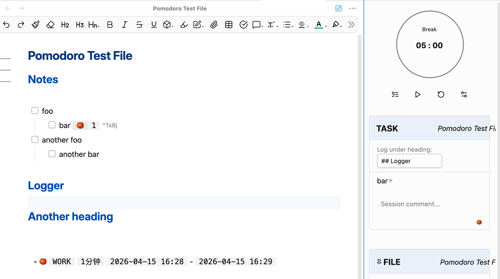

<h1 align="center">Pomodoro Timer for Obsidian (Community Fork)</h1>


Actively maintained as a second-level fork from [@rupel190](https://github.com/rupel190)'s community fork, originally based on [@eatgrass](https://github.com/eatgrass). This fork focuses on bug fixes and features needed for day-to-day use.

中文文档: [README-zh.md](README-zh.md)

## Why This Fork?

The original plugin by @eatgrass is no longer actively maintained. After community maintenance by @rupel190, this repository was forked again to continue fixing bugs and adding practical features needed in personal workflows. Contributions welcome!

## What's New in This Fork?

- Currently nothing

### TBD

- [ ] feature: Support for multi-tasks
- [ ] fix: UI for long file names
- [ ] fix: Implement Heading-aware Logging



## What's New in [@rupel190](https://github.com/rupel190)'s Fork?

- **Session comments in logs**: Add a short comment to each Pomodoro and keep it in your log output for later review.  
- **Quick Start Selected Task command**: Bind it to a hotkey to pick the task under cursor, pin it, and start timing immediately.  
- **Task panel upgrade**: The timer sidebar now separates current task and file task list, with filtering and search for faster task switching.  
- **Log under a heading (Not implemented yet)**: When your task file has headings, you can choose where logs are appended.  
- **Fork identity clarified**: This is an independently maintained fork with its own plugin identity (`pomodoro-timer-ex`).  
- **Under-the-hood improvements**: Internal architecture and UI code were reorganized to support more stable maintenance and future updates.  

## Introduction

A modern Pomodoro timer plugin for Obsidian, now with comment logging and more features on the horizon.

## Features

### [@eatgrass](https://github.com/eatgrass) version

- **Customizable Timer**: Adjust work/break durations to match your workflow.
- **System + Custom Audio Alerts**: Notification options for every environment.
- **Status Bar Display**: Monitor your progress directly from Obsidian's status bar to save screen space.
- **Daily Note Integration**: Log to your daily note or custom templates.
- **Verbose Metadata Output**: Includes `begin::`, `duration::`, `comment::` and more.
- **Task Tracking (🍅)**: Auto-increment actual pomodoro count in task metadata.

### [@rupel190](https://github.com/rupel190) version

- **Quick Start Command**: use the Quick Start Select Task command, which is bindable to a hot key, to select the task, pin it, and start the timer. Any timer that was already running for another task is logged.
- **Session Comment Input**: Add a short note for each Pomodoro and keep it in your logs.
- **Task + File Panels**: View your current task and file task list side by side, with filtering and search.
- **Heading-aware Logging (Not implemented yet)**: Choose a heading in your task file as the log destination when available.

---

## Notification

### Custom Notification Sound

1. Put the audio file into your vault.
2. Set its path relative to the vault's root.
   For example: your audio file is in `AudioFiles` and named `notification.mp3`, your path would be `AudioFiles/notification.mp3`.
   **Don't forget the file extension (like `.mp3`, `.wav` etc.).**
3. Click the `play` button next to the path to verify the audio

---

## Task Tracking

To activate this feature, first enable it in the settings. Then add pomodoros inline-field after your task's text description as below. The pomodoro timer will then automatically update the actual count at the end of each work session.

**Important: Ensure to add this inline-field before the [Tasks](https://github.com/obsidian-tasks-group/obsidian-tasks) plugin's fields. Placing it elsewhere may result in incorrect rendering within the Tasks Plugin.**

```markdown
-   [ ] Task with specified expected and actual pomodoros fields [🍅:: 3/10]
-   [ ] Task with only the actual pomodoros field [🍅:: 5]
-   [ ] With Task plugin enabled [🍅:: 5] ➕ 2023-12-29 📅 2024-01-10
```

---

## Log

### Log Format

The standard log formats are as follows
For those requiring more detailed logging, consider setting up a custom [log template](#Custom Log Template) as described below.

**Simple**

```
**WORK(25m)**: 20:16 - 20:17
**BREAK(25m)**: 20:16 - 20:17
```

**Verbose**

```plain
- 🍅 (pomodoro::WORK) (duration:: 25m) (begin:: 2023-12-20 15:57) - (end:: 2023-12-20 15:58)
- 🥤 (pomodoro::BREAK) (duration:: 25m) (begin:: 2023-12-20 16:06) - (end:: 2023-12-20 16:07)
```

---

### Templater - using a custom log template (Optional)

1. Install the [Templater](https://github.com/SilentVoid13/Templater) plugin.
2. Compose your log template script using the `log` object, which stores session information.

#### Plugin data to use with templater

```javascript
// TimerLog
{
    duration: number,  // duratin in minutes
    session: number,   // session length
    finished: boolean, // if the session is finished?
    mode: string,      // 'WORK' or 'BREAK'
    begin: Moment,     // start time
    end: Moment,       // end time
    task: TaskItem,    // focused task
 comment: string,
}

// TaskItem
{
    path: string,         // task file path
    fileName: string,     // task file name
    text: string,         // the full text of the task
    name: string,         // editable task name (default: task description)
    status: string,       // task checkbox symbol
    blockLink: string,    // block link id of the task
    checked: boolean,     // if the task's checkbox checked
    done: string,         // done date
    due: string,          // due date
    created: string,      // created date
    cancelled: string,    // cancelled date
    scheduled: string,    // scheduled date
    start: string,        // start date
    description: string,  // task description
    priority: string,     // task priority
    recurrence: string,   // task recurrence rule
    tags: string[],       // task tags
 expected: number,     // expected pomodoros
 actual: number        // actual pomodoros
}
```

#### Example

```javascript
<%*
if (log.mode == "WORK") {
  if (!log.finished) {
    tR = `🟡 Focused ${log.task.name} ${log.duration} / ${log.session} minutes`;
  } else {
    tR = `🍅 Focused ${log.task.name} ${log.duration} minutes`;
  }
} else {
  tR = `☕️ Took a break from ${log.begin.format("HH:mm")} to ${log.end.format(
    "HH:mm"
  )}`;
}
%>
```

#### Example to write in separate files

[Template that writes all tasks inside the folder to a single file](https://github.com/rupel190/obsidian-plugin-pomodoro-template)

---

### Examples of using DataView (Optional)

As the name suggests, data written using Templater can be dynamically viewed with DataView.

#### Example: Log Table

This DataView script generates a table showing Pomodoro sessions with their durations, start, and end times.


<pre>
```dataviewjs
const pages = dv.pages()
const table = dv.markdownTable(['Pomodoro','Duration', 'Begin', 'End'],
pages.file.lists
.filter(item=>item.pomodoro)
.sort(item => item.end, 'desc')
.map(item=> {

    return [item.pomodoro, `${item.duration.as('minutes')} m`, item.begin, item.end]
})
)
dv.paragraph(table)

```  
</pre>

#### Example: Summary View

This DataView script presents a summary of Pomodoro sessions, categorized by date.


<pre>
```dataviewjs
const pages = dv.pages();
const emoji = "🍅";
dv.table(
  ["Date", "Pomodoros", "Total"],
  pages.file.lists
    .filter((item) => item?.pomodoro == "WORK")
    .groupBy((item) => {
      if (item.end && item.end.length >= 10) {
        return item.end.substring(0, 10);
      } else {
        return "Unknown Date";
      }
    })
    .map((group) => {
      let sum = 0;
      group.rows.forEach((row) => (sum += row.duration.as("minutes")));
      return [
        group.key,
        group.rows.length > 5
          ? `${emoji}  ${group.rows.length}`
          : `${emoji.repeat(group.rows.length)}`,
        `${sum} min`,
      ];
    })
)
```
</pre>

---

## CSS Variables

| Variable                       | Default            |
| ------------------------------ | ------------------ |
| --pomodoro-timer-color         | var(--text-faint)  |
| --pomodoro-timer-elapsed-color | var(--color-green) |
| --pomodoro-timer-text-color    | var(--text-normal) |
| --pomodoro-timer-dot-color     | var(--color-ted)   |

## FAQ

1. How to Switch the Session

To switch sessions, simply click on the `Work/Break` label displayed on the timer.

2. How to completely disable `Break` sessions

You can adjust the break interval setting to `0`, this will turn off `Break` sessions.
